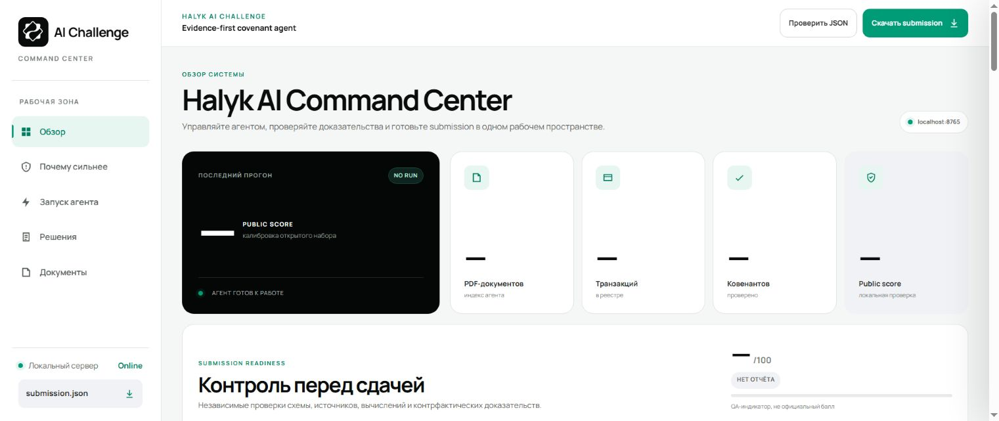
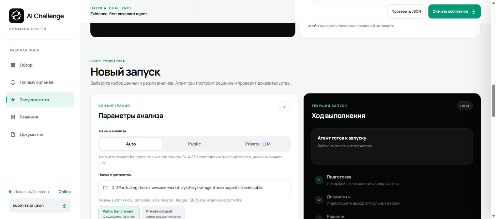

# Halyk Covenant Agent
### Every covenant verdict needs a path back to its evidence.

A document-analysis agent for the Halyk AI Challenge. It reads a document archive and transaction ledger, identifies applicable document versions, constructs a constrained calculation plan and produces a validated covenant result with a trace.

*The implemented local Command Center in its clean, no-run state. No customer documents or transaction data are included in this screenshot.*

## The archive is part of the problem

A covenant may depend on a final contract, an amendment, a waiver, an audit note and a particular set of transactions. Treating every extracted paragraph as equally authoritative can produce a numerically correct answer to the wrong version of the agreement.

The agent inventories PDFs with hashes and page-level text, classifies document roles and looks for applicable final versions. Pages with insufficient text can be routed through vision OCR in the model-backed mode. The resulting evidence needs both content and provenance before planning begins.

## Ask the model for a plan, not the final number

The planner returns structured output against the covenant schema: sources, relevant facts, a formula and candidate transaction evidence. An independent reviewer checks the plan against the original material. That creates a boundary at which unsupported document references, unknown transaction IDs and disallowed expressions can be rejected.

Arithmetic runs in a constrained deterministic layer using **Decimal**. The expression language supports a limited set of operations rather than executing arbitrary model-generated code. Rounding happens at the output boundary, so intermediate floating-point behaviour does not quietly alter a threshold comparison.

~~~mermaid
flowchart LR
 A[PDF archive and ledger] --> B[Inventory and version resolution]
 B --> C[Evidence extraction / OCR]
 C --> D[Structured semantic plan]
 D --> E[Independent review]
 E --> F[Reference and formula validation]
 F --> G[Decimal calculation]
 G --> H[Counterfactual evidence check]
 H --> I[Submission and decision trace]
~~~

## A transaction must matter to the verdict

Merely citing a transaction is not enough. The counterfactual check removes a candidate evidence transaction and examines whether the relevant verdict changes. This tests the claimed relationship between the cited transaction and the result instead of accepting a plausible-looking identifier.

Waivers and applicability exceptions are represented explicitly, keeping the measured actual value separate from a documented status override. A reviewer should be able to distinguish “the value is below the threshold” from “the threshold is not applicable under this exception.”

## The Command Center is an inspection surface

*The Command Center explains the document inventory, revision resolver, structured plan, Decimal engine and counterfactual evidence check.*

The local web panel organizes overview, run configuration, results and project documents. It can display preflight findings, a decision matrix, calculated values and the trace behind a selected result. A submission hash connects the displayed quality checks to a particular output file.

*Run configuration distinguishes Auto, Public and Private/LLM modes. The panel is idle, with no customer material loaded or model run started.*

| Check | What it prevents |
|---|---|
| Dataset preflight | Starting with missing required files or unusable inputs |
| Document and transaction references | Citing evidence that does not exist |
| Formula validation | Unsupported computation entering the calculation layer |
| Counterfactual check | Attaching a transaction that does not support the claimed verdict |
| Submission schema validation | Delivering the wrong keys, types or output structure |

**Implementation:** Python, PDF extraction / OCR, structured model output, independent review, Decimal calculations and a standard-library local web server. The browser receives provider-configuration status, not API keys.

## Results, with the right denominator

The documented **36/36 public calibration result** checks the known public material and calculation/output path. The public fact package is only enabled for an exact matching dataset fingerprint; it does not demonstrate model performance on unseen private documents. The separate competition result was **26th of 160 ranked teams**.

The screenshot shows the actual application shell without loading financial documents. The detailed walkthrough here explains the implemented evidence and calculation boundaries; it does not present an empty local dashboard as a newly completed benchmark run.

---

### Built by

**QwertyS** — [Shakhnazar Akhmer](https://github.com/Eye172) and [Nurkhan Aimukatov](https://github.com/pip00sya).

[More projects](https://github.com/Eye172) · [Contact](mailto:shakh090909@gmail.com)

This repository presents the product and its engineering. Implementation and internal data are maintained separately. Screenshots and documented experiments are identified in their captions.
